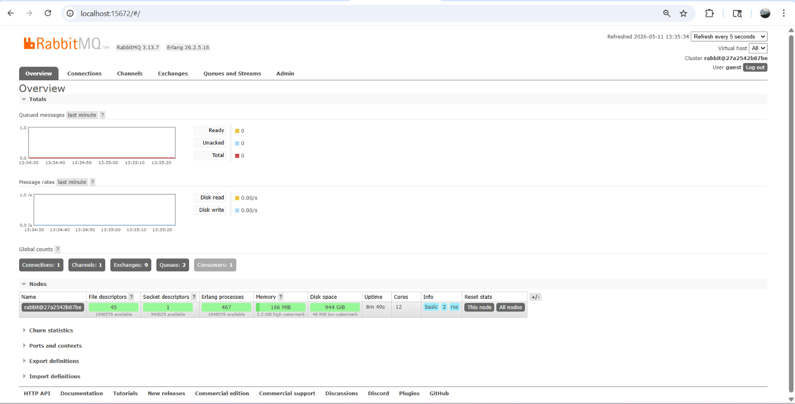
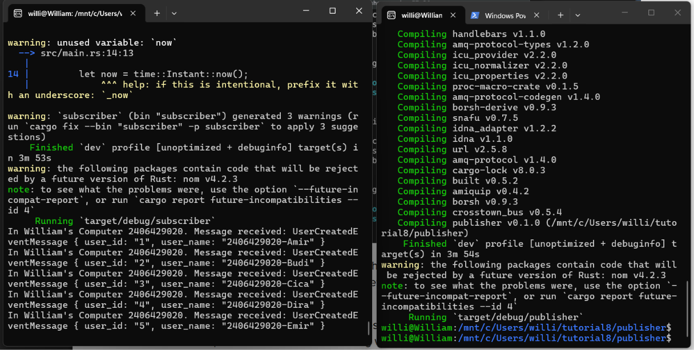
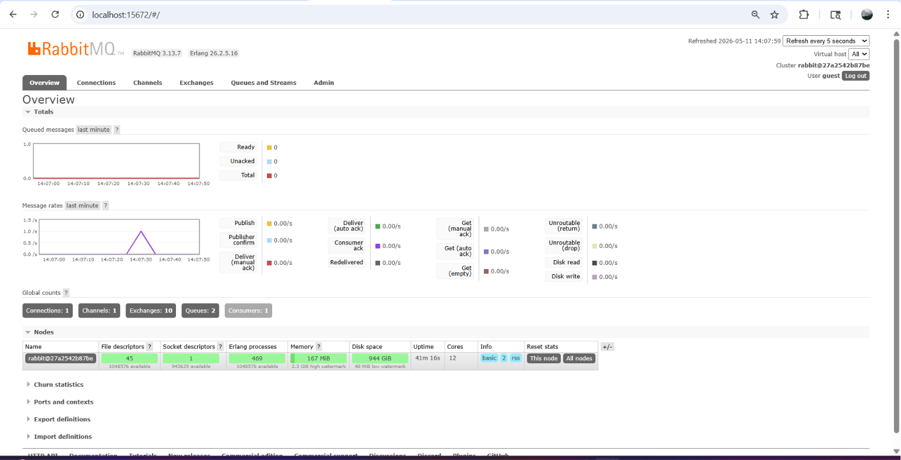

1. Step 7\
a. Publisher kamu akan mengirimkan 5 pesan (messages) ke message broker dalam satu kali eksekusi. Hal ini bisa dilihat karena metode p.publish_event() dipanggil tepat lima kali secara berurutan. Setiap panggilan mengirimkan satu objek UserCreatedEventMessage yang berisi data pengguna yang berbeda (Amir, Budi, Cica, Dira, dan Emir).\
b. Publisher maupun subscriber terhubung ke message broker yang persis sama. Dalam sistem antrian pesan (message queuing), broker bertindak sebagai pusat terminal. Agar subscriber berhasil menerima pesan yang dikirim oleh publisher, keduanya wajib terhubung ke alamat server yang sama, di port yang sama, dan menggunakan kredensial yang sama agar bisa saling berkomunikasi di jalur antrean (user_created) tersebut.

2. Running Rabbit MQ:

3. Sending and Processing Event

Publisher (kanan) mengirimkan 5 pesan (berisi data Amir, Budi, Cica, Dira, dan Emir) ke message broker (RabbitMQ). Setelah kelima pesan terkirim, program selesai. Begitu Subscriber berjalan (kiri), ia terhubung ke RabbitMQ dan terus "mendengarkan" antrian pesan (user_created).

4. Monitoring Chart

RabbitMQ memantau seberapa banyak data yang lewat (saat kedua program dijalankan). Karena menerima rentetan 5 pesan hanya dalam waktu beberapa milidetik, "kecepatan" pengiriman pesan per detiknya melonjak tajam, sehingga menciptakan garis lonjakan berwarna ungu pada grafik tersebut. Setelah publisher selesai dan berhenti mengirim data, kecepatannya langsung turun kembali ke angka nol.